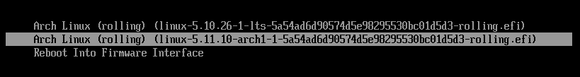
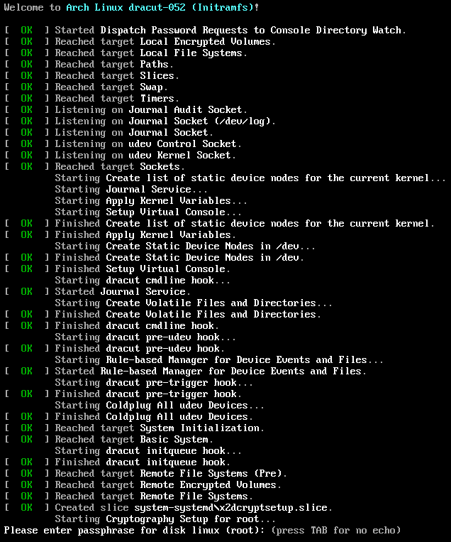

# Arch Linux with LUKS and (almost) no configuration

Installing Arch on a LUKS-encrypted dsik traditionally required a few careful configuration steps to configure the proper root device for booting; if any of these steps was omitted or done wrongly the system would fail to boot. With systemd and dracut however a LUKS-encrypted Arch system can boot safely and reliably without any configuration:

* Dracut builds a unified EFI kernel image including microcode and a generic initrd with systemd and cryptsetup.
* systemd-boot automatically discovers unified kernel images installed by dracut and automatically adds them to the boot menu without explicit boot loader configuration.
* At boot systemd automatically discovers and mounts the root file system following its [DISCOVERABLE PARTITIONS](https://systemd.io/DISCOVERABLE_PARTITIONS/) specification.

The following commands demonstrate a fresh Arch installation from the Arch installation media into a libvirt VM. Installing to a pristine physical machine or a different virtual machine provider should require only minimal changes; adapting an existing system may be more difficult and require more work.

<!--more-->

## Prepare the disk

```console
$ sgdisk
    -n1:0:+500M  -t1:ef00 -c1:EFISYSTEM
    -n2:0:+1000M -t2:ea00 -c2:XBOOTLDR
    -N3          -t3:8304 -c3:linux
    /dev/vda
$ mkfs.fat -F32 -n EFISYSTEM /dev/disk/by-partlabel/EFISYSTEM
$ mkfs.fat -F32 -n XBOOTLDR /dev/disk/by-partlabel/XBOOTLDR
$ cryptsetup luksFormat /dev/disk/by-partlabel/linux
$ cryptsetup luksOpen /dev/disk/by-partlabel/linux root
$ mkfs.btrfs -L linux /dev/mapper/root
```

This creates a 500M EFI system partition for the boot loader and the kernel, a 1000M extended boot loader partition for systemd-boot (entirely optional, but helpful for rescue systems or Windows dual-boot), and fills the rest of the partition with a LUKS parition holding a btrfs filesystem. Each partition gets the proper type code (`-t`) corresponding to the [discoverable partition GUID](https://systemd.io/DISCOVERABLE_PARTITIONS/) (e.g. `8304` refers to the “Linux x86-64 root (/)” partition); this enables systemd to automatically mount the partition. For convenience each partition also gets a GPT partition label (`-c`) which we can use to refer to the partition by name under `/dev/disk/by-partlabel` instead of remembering the numeric order of partitions as in `/dev/vda1`.

## Install and configure the base system

We now install a base Arch system on top of the new file system:

```console
$ mount /dev/mapper/root/ /mnt
$ mkdir /mnt/{boot,efi}
$ btrfs subvolume create /mnt/var
$ btrfs subvolume create /mnt/home
$ mount /dev/disk/by-partlabel/EFISYSTEM /mnt/efi
$ mount /dev/disk/by-partlabel/XBOOTLDR /mnt/boot
$ reflector --save /etc/pacman.d/mirrorlist --protocol https --latest 5 --sort age
$ pacstrap /mnt base linux linux-lts linux-firmware intel-ucode btrfs-progs dracut neovim
$ arch-chroot /mnt
$ ln -sf /usr/share/zoneinfo/UTC /etc/localtime
$ nvim /etc/locale.gen /etc/locale.conf /etc/vconsole.conf /etc/hostname /etc/hosts
$ locale-gen
$ passwd
```

Note that we explicitly do _not_ create `/etc/fstab`.

## Generate unified kernel image

While still in `chroot` we install the optional dependencies `dracut` requires to build unified kernel images and then run dracut for all kernels we installed above.

```console
$ pacman -S --asdeps binutils elfutils
$ for kver in /lib/modules/*; do dracut -f --uefi --kver "${kver##*/}"; done
```

## Install the boot loader

Next we install the `systemd-boot` boot loader, again still from `chroot`; we need no further configuration as we mount the EFI and boot loader paritions at their standard paths `/efi` and `/boot` respectively.

```console
$ bootctl install
```

## Continue installation

At this point we can install additional packages and enable services; for the purpose of this demonstration we’ll add a simple network configuration:

```console
$ cat > /etc/systemd/network/20-wired.network <<EOF
[Match]
Name=enp1s0

[Network]
DHCP=yes
EOF
$ umount /etc/resolve.conf
$ ln -sf /run/systemd/resolve/stub-resolve.conf /etc/resolve.conf
$ systemctl enable systemd-network.service
$ systemctl enable systemd-timesyncd.service
$ systemctl enable systemd-resolved.service
```

At the time of writing `arch-chroot` bind-mounts the live disk `resolve.conf` into the chroot; we need to unmount it explicitly before we can setup the systemd stub resolver for the new installation.

For a real server or desktop installation we would likely install more packages and services and setup user accounts at this point to boot into a fully working system. I usually run my [`arch/install.bash`](https://github.com/lunaryorn/dotfiles/blob/f40ea05cd64dc90ba5ed1824eeca2ee4c657f11b/arch/install.bash) script when installing a desktop system (for servers I tend to use other distributions, or one of the Arch Linux cloud images)

## Reboot into the new system

```console
$ exit
$ poweroff
```

Now we can remove the installation media and start the system again; by holding the space key during boot we make the boot menu appear to verify that the generated unified kernel images are indeed recognized by systemd-boot:



systemd-boot seems to pick the image with the highest version number automatically. Upon boot the image automatically discovers the LUKS root partition and offers to unlock it:



All this happens automatically; we did not have to configure `/etc/fstab` and `/etc/crypttab.initramfs` to specify the root filesystem, nor `/etc/mkinitcpio.conf` to include the right systemd and cryptsetup hooks.

## Configuring for more convenience

At this point the system boots perfectly fine without any configuration, but nonetheless there are a few relevant configuration switches.

### Generate kernel images upon installation

Currently the dract package includes no libalpm hooks to build new EFISTUB binaries on kernel updates. The Arch wiki documents the [hooks necessary to make this happen](https://wiki.archlinux.org/index.php/Dracut#Generate_a_new_initramfs_on_kernel_upgrade); I use `dracut-hook-uefi-systemd` from AUR to automate this.

### Optimize the initrd

By default dracut builds a generic initrd which works on any hardware and system; this mode is intended for distribution vendors which ship a prebuilt initrd as a package. Arch however builds the initrd on the system after installation; this allows us to enable host-only mode to reduce the size of the image and embed host-specific kernel flags. Dracuts reads configuration files from `/etc/dracut.conf.d`, e.g. `/etc/dracut.conf.d/50-host-only.conf`:

```ini
# Hide all systemd messages at startup
kernel_cmdline="quiet"
# Use hostonly to exclude unnecessary modules, but do not include the hostonly
# cmdline in the image, because at the time of writing it has a few issues with
# discoverable partitions.
# See <https://github.com/dracutdevs/dracut/issues/723#issuecomment-792248568>
hostonly="yes"
hostonly_cmdline="no"
```

### Configure the boot menu

systemd-boot enables the kernel command line editor by default, to aid with fixing unbootable systems. With physical access to the machine we can gain root access by booting into `/bin/sh` with proper kernel parameters. In our system the impact of this security hole is limited since the attacker cannot unlock the encrypted root disk to do anything with the system, but nonetheless it’s recommended to disable the editor in `/efi/loader/loader.conf`. At this place we can also change the boot menu timeout, and set the default kernel.

```ini
# Disable the editor to improve security a bit.
editor no
# Directly boot the default kernel; to make the boot menu appear
# press any key during the firmware splash screen.
timeout 0
# Boot the LTS kernel by default.
default linux-*-lts-*
```

The `default` stanza supports glob patterns; systemd boot then picks the matching image with the highest version. The pattern in the above example matches the linux LTS kernel.

## Conclusion

This setup now boots seamlessly into the getty prompt:


