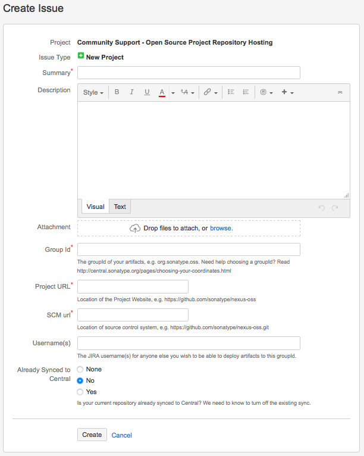

# Maven Central Releases with SBT

Coming from Haskell and Python I found releasing a Scala library a cumbersome process.
The standard [Maven Central][] archive lacks a convenient web interface like that of Python’s package index or Haskell’s Hackage, and comprehensive documentation about publishing.
Getting an artifact to Maven Central for the first time involves a surprising number of manual steps and a rather elaborate SBT configuration.

In this article I hope to connect all the loose ends and offer a comprehensive stepby-step guide from nothing to a Maven Central release.
I will start with some prerequisites which lie outside the scope of this article, guide you through the necessary bureaucracy and cover the setup.
At the end I’ll introduce sbt-release, a powerful plugin to automate the entire release.

<!--more-->

[Maven Central]: https://search.maven.org

<!--more-->

## Prerequisites

**Summary**: You need a working GNU Privacy Guard (GPG) setup.

----

Maven Central requires GPG signatures for all artifacts, so you need a GPG key and a working GPG setup for signatures.
GitHub offers a terse [guide][gpg] to a minimal GPG setup for signing commits which also covers all you need for signing artifacts for Maven Central.

[gpg]: https://help.github.com/articles/signing-commits-with-gpg/

GPG comes in three different versions:  GPG 1.x, GPG 2.0 and GPG 2.1.
All these versions are incompatible with each other, and—to a varying degree—also with existing tools around GPG.
In particular, due to a change in the internal storage format in GPG 2.1 most existing GPG tooling cannot use private keys created with GPG 2.1 at the time of writing.

I recommend you avoid GPG 2.1 and stick with version 2.0 until tooling becomes compatible—you can upgrade to GPG 2.1 later.
I suggest to pick a graphical user interface, such as [GPGTools][] for macOS.

[GPGTools]: https://gpgtools.org

## Choose a group ID

**Summary**: Pick a group ID, either by reversing the name of domain (`example.com` → `com.example`) you own or the name of your GitHub pages domain (User `example` → `io.github.example`) if you do not own a domain.

----

[Maven][], and by extension Maven Central and SBT, put all artifacts in namespaces called “groups”.
You see these groups in SBT dependency specifications:

[Maven]: https://maven.apache.org

```scala
libraryDependencies += "org.typelevel" %% "cats" % "0.9.0"
```

This expression specifies a dependency on the artifact with “artifact ID” `cats` in the `org.typelevel` “group ID”.
The same artifact ID can appear under different group IDs and refer to a entirely different artifact.
In other words, `"com.example" %% "cats" % "0.9.0"` refers to a different artifact than the above and has no relation to the actual [Cats][] library.
Groups avoid collisions in common names[^conflicts] and allow you to publish patched or forked versions of a library without interfering with the upstream project.

[^conflicts]: Such conflicts tend to produce strange results in languages that have no namespaces for artifacts.
    For instance a popular HTTP client library for the [Rust language][rust] goes by the name [reqwest][] (sic!) because someone else had already claimed the more obvious [request][] and did not offer the name to the HTTP client library that started later.

[cats]: https://typelevel.org/cats/index.html
[rust]: https://www.rust-lang.org/en-US/
[reqwest]: https://crates.io/crates/reqwest
[request]: https://crates.io/crates/request

To publish an artifact to Maven Central you need to choose your own group ID first.
Most people choose reverse domain names[^rdn] as group IDs.
For instance, the [Typelevel][] organization which maintains the Cats library (see above) owns the domain `typelevel.org` so the `org.typelevel` group ID has the official cats artifact.
Likewise I use the group ID `com.lunaryorn`, from my domain `lunaryorn.com`.

If you own a domain related to you or—even better—to the project or library you plan to release use it for your group ID.
If you release a library on behalf of a company, eg, your employer or an affiliate, use the brand domain of the Company.
For instance, if you released a library on behalf of the hypothetical [Acme Corporation][acme] owning `acme.com` you would use `com.acme` as group ID.
If you do not own a domain but have a GitHub account you may use the domain of your GitHub pages instead.
For instance, my GitHub username “lunaryorn” gives me the GitHub pages domain “lunaryorn.github.io”, leading to my “GitHub” group ID `io.github.lunaryorn`.

[acme]: https://en.wikipedia.org/wiki/Acme_Corporation
[Typelevel]: https://typelevel.org/about/

[^rdn]: Scala adopted this convention from the Java.
    Since domain names never conflict by definition this convention avoids conflicts in group IDs by design.

## Create a Maven Central account

**Summary**: Create an account on the [Sonatype issue tracker][jira] and add it to the `credentials` setting in your global SBT configuration.
Then create an issue to add your project to Maven Central.

----

Sonatype—the company which runs Maven—offers an [issue tracker][jira] to ask for access to Maven Central.
Create an account on this issue tracker if you do not already have one.
This account later grants you access to Maven Central; you will use it every time you upload an artifact on Maven Central so it's important to remember this account and keep it safe.

[jira]: https://issues.sonatype.org

To publish artifacts from SBT—we will automate the entire release with SBT later in this article—add these credentials to the `credentials` setting of SBT (replace the placeholders with the actual credentials of your account):

```scala
credentials += Credentials(
  "Sonatype Nexus Repository Manager",
  "oss.sonatype.org",
  "<USERNAME>",
  "<PASSWORD>")
```

Do **not** change the first two arguments; they must match the authentication challenge of Maven Central for SBT to associate the credentials with the repository.

I keep this setting in `~/.sbt/0.13/credentials.sbt` as part of my global configuration but you can also add it to a per-project SBT file.
Just make sure to keep the file safe and do not commit it to a public repository!

## Register your artifact and group ID on Maven Central

**Summary**: Create a new [issue][] to register your artifact and group ID, and wait until Sonatype grants you access.

---

[issue]: https://issues.sonatype.org/secure/CreateIssue.jspa?issuetype=21&pid=10134

Login with your account (see above), create a new [issue][].
You will see the following form now:



Fill it as follows:

**Summary**
: Briefly mention the project you’d like to add to Maven Central.

**Description**
: Describe what purpose your project serves and what it offers.

**Group Id**
: Enter the group ID you chose above.

**Project URL**
: Enter the URL to the homepage of your project, or the GitHub README.

**SCM url**
: Enter the URL to the source code of your project, accessible by a version control system like Git or Mercurial.

**Username(s)**
: Add the Sonatype Jira user names of any users you’d also like to allow to publish the artifact using their own accounts.

After submitting the ticket Sonatype will review your request.
According to [Open Source Software Repository Hosting (OSSRH) Guide, Create a ticket with Sonatype][1] this takes less than two business days—I received confirmation after a couple of hours.
Sonatype warns you **not** to try and publish anything before the ticket enters the **Resolved** state.
I do not know what happens if you do, but I presume you will need another round with Sonatype’s support if you do—better avoid it in the first place.

[1]: https://central.sonatype.org/pages/ossrh-guide.html#create-a-ticket-with-sonatype

## Configure required metadata in SBT

**Summary**: Add group and artifact IDs, version number, project name, description, URL, license, developers and source control info to your `build.sbt`.
Sonatype requires this metadata for Maven Central artifacts.

----

Sonatype requires packages to have the following metadata (see [Requirements, Sufficient Metadata][2]):

```scala
// The project name, will become the artifact ID
name := "foo-lib"
// The group ID you have registered with, see above
organization := "com.example"
// A human readable description and the project homepage
description := "A Maven Central example"
homepage := Some(url(s"https://www.example.com"))
// The project’s license
licenses += "The Apache License, Version 2.0" ->
  url("http://www.apache.org/licenses/LICENSE-2.0.txt")
// The developers of the project
developers := List(
  Developer(
    id="jdoe",
    name="Jane Doe",
    email="jane.doe@example.com",
    url=url("https://www.example.com/~jane.doe/")
  )
)
// Information about the source code repository of your code
scmInfo := Some(ScmInfo(
  url("https://github.com/example/foo-lib"),
  "scm:git:https://github.com/example/foo-lib.git",
  Some(s"scm:git:git@github.com:example/foo-lib.git")
))
```

Add this metadata to the `build.sbt` of your project.
Without this metadata Maven Central will reject your artifacts when you try to publish.

[2]: https://central.sonatype.org/pages/requirements.html#sufficient-metadata

## Configure publishing in SBT

**Summary:** Add the [sbt-sonatype][] plugin to your build, enable the `publishMavenStyle` setting in `build.sbt` and set the `publishTo` setting to `sonatypeDefaultResolver`.
Add the [sbt-pgp][] to enable GPG signing of artifacts.

----

While SBT installs dependencies from Maven Central by default it does not publish to Maven Central without further configuration.
The [sbt-sonatype][] offers settings and commands to publish to Sonatype repositories, including Maven Central.
Add this plugin to the `project/plugins.sbt` of your project:

```scala
addSbtPlugin("org.xerial.sbt" % "sbt-sonatype" % "2.0")
```

[sbt-sonatype]: https://github.com/xerial/sbt-sonatype

Then add the following settings to `build.sbt` to force SBT to publish Maven style artifacts (as opposed to the default Ivy style) and point SBT to the Maven Central repository:

```scala
publishMavenStyle := true
publishTo := Some(sonatypeDefaultResolver.value)
```

As said above Sonatype requires GPG signatures for artifacts, but SBT does not support GPG by default.
You need to add the [sbt-pgp][] plugin to `project/plugins.sbt`:

```scala
addSbtPlugin("com.jsuereth" % "sbt-pgp" % "1.0.1")
```

[sbt-pgp]: https://github.com/sbt/sbt-pgp

You also need a working GPG setup which I do not cover in this article.
See the Prerequisites section above for help.

## Publish manually

**Summary:** You can now publish manually with `publishSigned` and `sonatypeRelease`.

----

I recommend to automate releases with the [sbt-release][] plugin which I cover in the next section below but the configuration so far lets you now publish artifacts manually.

[sbt-release]: https://github.com/sbt/sbt-release

I suggest to start with a snapshot version to check whether Sonatype authentication works.
Open a shell in the directory of your project and type:

```console
$ sbt
> set version := "0.1-SNAPSHOT"
> publishSigned
```

The `publishSigned` task comes from the [sbt-pgp][] plugin configured above.
It builds your project, packages byte code, sources and scaladoc into JARs, signs them with GPG and publishes these to the Sonatype snapshot repository because the version has a `SNAPSHOT` suffix.
You can publish snapshots to this repository as often as you like which makes it the ideal testing ground for your publishing configuration.

The task will ask you for the passphrase of your GPG key along the way to sign archives.
If signing and publishing work you will see that SBT publishes

* a [Project Object Model (POM)][pom] file containing the metadata of your artifacts,
* a couple of JARs with byte code and sources,
* and `.asc` files containing the signatures for all these

to `repositories/snapshots` on `https://oss.sonatype.org`.

[pom]: https://maven.apache.org/guides/introduction/introduction-to-the-pom.html

In this case you can now try to publish a stable version if you like, but you cannot retract stable versions from Maven Central.
Make sure that your project allows for a stable release before continuing with this guide!

Publishing a stable version requires two stages.
In the first step you publish to the staging repository:

```console
$ sbt
> set version := "0.1"
> publishSigned
```

Unlike before the task will now publish to the staging repository because the version lacks the `-SNAPSHOT` suffix.
You can publish to staging as often as you like without harm but you cannot use artifacts from staging.

To promote your artifacts to the actual Maven Central repository and thus make them available to the public run the following command in the SBT shell:

```
> sonatypeRelease
```

This task contacts a special REST API of Sonatype which asks Sonatype to verify your artifacts.
Sonatype now checks all requirements for Maven Central, ie, GPG signatures, required metadata, presence of doc and source JARs, etc.
If Sonatype rejects your artifact at this stage you can fix the offenses and try again as often as you need.

After a successful `sonatypeRelease` the artifact moves to Maven Central, but can take up to ten minutes to appear there.

## Automate releases

**Summary:** Add [sbt-release][] to automate the entire release, from building and testing, to bumping version numbers, to publishing and pushing changes.
To use this plugin with Maven Central set `releasePublishArtifactsAction` to `publishSigned` and add `sonatypeRelease` to the `releaseProcess`.
For projects that support different Scala versions also enable `releaseCrossBuild` to release for all supported versions at once.

----

If you prefer to automate releases I recommend the [sbt-release][] plugin which provides a simple `release` task to cover all the following steps:

1. Build and test the project.
2. Increase the version number.
3. Commit the changes and tag the release.
4. Publish artifacts.
5. Push all changes and tags to the remote repository, eg, GitHub.
6. Move to the next snapshot version.
7. Propagate artifacts from staging to Maven Central, see above.

Add the plugin to `project/plugins.sbt`:

```scala
addSbtPlugin("com.github.gseitz" % "sbt-release" % "1.0.5")
```

Then add the following settings to `build.sbt` for seamless integration with Maven Central:

```scala
releasePublishArtifactsAction := PgpKeys.publishSigned.value
releaseProcess += releaseStepCommand("sonatypeRelease")
```

With these settings sbt-release publishes signed artifacts as required by Maven Central and automatically promotes artifacts from staging to Maven Central (see above) as last step.

Also make sure to remove `version` from your `build.sbt`.
The plugin manages the version number for you in a separate `version.sbt` file. If you had a version number in `build.sbt` move it to `version.sbt` before using `sbt-release`.

If your project supports different Scala versions, eg, 2.11 and 2.12, via `crossScalaVersions` also enable `releaseCrossBuild` to release for all versions at once:

```scala
releaseCrossBuild := true
```

With this configuration releases become as simple as running `sbt release`!
The command will

* ask you for the next version,
* build and test everything,
* commit and tag the release,
* publish artifacts,
* then bump to the next snapshot version,
* and promote the released artifacts to Maven Central.

If you do not like the default messages for tags and commits change `releaseTagComment` and `releaseCommitMessage` respectively.
I prefer the following style:

```scala
releaseTagComment := s"$name$ ${version.value}"
releaseCommitMessage := s"Bump version to ${version.value}"
```

Use whatever you like or whatever the conventions of your project require.

## Further reading

GitHub has a brief [guide][gpg] about GPG setup.

The README of sbt-release show how to define [custom release steps][custom].
The [refined][] library for instance defines custom steps to update the changelog and README before a release and upload documentation to Github Pages, see [build.sbt, line 369][369].

[custom]: https://github.com/sbt/sbt-release#can-we-finally-customize-that-release-process-please
[refined]: https://github.com/fthomas/refined
[369]: https://github.com/fthomas/refined/blob/55ef23ccba366821642c954118686f69c8b7aadf/build.sbt#L369

[Timothy Perrett][tp] wrote about his [continuous delivery][cd] approach where he uses the [sbt-rig][] plugin to release every single commit on `master`.
The sbt-rig plugin bundles sbt-release and other plugins to offer a simple abstraction over releases.
Justin Kaeser just told me about [sbt-release-early][] which offers a simple approach to “Release Early, Release Often”.
I find it interesting and think about trying it in my next project.

[tp]: https://timperrett.com/who
[cd]: https://timperrett.com/2016/10/02/continuous-delivery-for-scala-with-travisci/
[sbt-rig]: https://github.com/verizon/sbt-rig
[sbt-release-early]: https://github.com/scalacenter/sbt-release-early

Sonatype’s own [OSSRH Guide][ossrh] documents publishing to Maven Central, albeit in terse form, with much information hidden in videos.
I use it as reference but found it a poor introduction for new users.
The SBT manual includes a guide to [Using Sonatype][] which covers the SBT setup in some detail but looses little words on the Sonatype bureaucracy.

[ossrh]: https://central.sonatype.org/pages/ossrh-guide.html
[Using Sonatype]: https://www.scala-sbt.org/release/docs/Using-Sonatype.html

The official [SBT documentation][sbt-doc] improved a lot and has now become a great resource to learn and to understand SBT.

[sbt-doc]: https://www.scala-sbt.org/1.x/docs/index.html
